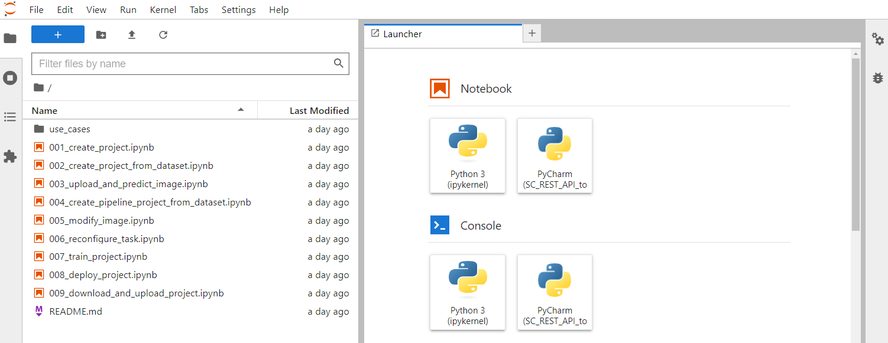

<div align="center">

[]()
[](https://github.com/openvinotoolkit/openvino)


![Nightly Tests [Geti latest] Status](https://img.shields.io/github/actions/workflow/status/openvinotoolkit/geti-sdk/nightly-tests-geti-latest.yaml?label=nightly%20tests%20%5BGeti%20latest%5D&link=https%3A%2F%2Fgithub.com%2Fopenvinotoolkit%2Fgeti-sdk%2Factions%2Fworkflows%2Fnightly-tests-geti-latest.yaml)
![Nightly Tests [Geti develop] Status](https://img.shields.io/github/actions/workflow/status/openvinotoolkit/geti-sdk/nightly-tests-geti-develop.yaml?label=nightly%20tests%20%5BGeti%20develop%5D&link=https%3A%2F%2Fgithub.com%2Fopenvinotoolkit%2Fgeti-sdk%2Factions%2Fworkflows%2Fnightly-tests-geti-develop.yaml)

[](https://www.bestpractices.dev/projects/8329)

</div>

---

# Introduction

Welcome to the Intel® Geti™ SDK! The [Intel® Geti™ platform](https://geti.intel.com) enables
teams to rapidly develop AI models. The platform reduces the time needed to build
models by easing the complexities of model development and harnessing greater
collaboration between teams. Most importantly, the platform unlocks faster
time-to-value for digitization initiatives with AI.

The Intel® Geti™ SDK is a python package which contains tools to interact with an
Intel® Geti™ server via the REST API. It provides functionality for:

- Project creation from annotated datasets on disk
- Project downloading (images, videos, configuration, annotations, predictions and models)
- Project creation and upload from a previous download
- Deploying a project for local inference with OpenVINO
- Getting and setting project and model configuration
- Launching and monitoring training jobs
- Media upload and prediction

This repository also contains a set of (tutorial style) Jupyter
[notebooks](https://github.com/openvinotoolkit/geti-sdk/tree/main/notebooks)
that demonstrate how to use the SDK. We highly recommend checking them out to get a
feeling for use cases for the package.

# Getting started

## Installation
Using an environment manager such as
[miniforge](https://github.com/conda-forge/miniforge) or
[venv](https://docs.python.org/3/library/venv.html) to create a new
Python environment before installing the Intel® Geti™ SDK and its requirements is
highly recommended.

> **NOTE**: If you have installed multiple versions of Python,
> use `py -3.9 venv -m <env_name>` when creating your virtual environment to specify
> a supported version (in this case 3.9). Once you activate the
> virtual environment <venv_path>/Scripts/activate, make sure to upgrade pip
> to the latest version `python -m pip install --upgrade pip wheel setuptools`.

### Python version compatibility
Make sure to set up your environment using one of the supported Python versions for your
operating system, as indicated in the table below.

|             | Python <= 3.8 | Python 3.9         | Python 3.10        | Python 3.11        | Python 3.12        | Python 3.13 |
|:------------|:-------------:|:------------------:|:------------------:|:------------------:|:------------------:|:-----------:|
| **Linux**   | :x:           | :heavy_check_mark: | :heavy_check_mark: | :heavy_check_mark: | :heavy_check_mark: | :x:         |
| **Windows** | :x:           | :heavy_check_mark: | :heavy_check_mark: | :heavy_check_mark: | :heavy_check_mark: | :x:         |
| **MacOS**   | :x:           | :heavy_check_mark: | :heavy_check_mark: | :heavy_check_mark: | :heavy_check_mark: | :x:         |

Once you have created and activated a new environment, follow the steps below to install
the package.

### Installing from PyPI
Use `pip install geti-sdk` to install the SDK from the Python Package Index (PyPI). To
install a specific version (for instance v1.5.0), use the command
`pip install geti-sdk==1.5.0`

### Installing from the Git repo
1. Download or clone the repository and navigate to the root directory of the repo in
   your terminal.

2. **Base installation** Within this directory, install the SDK using `pip install .` This command will install the
   package and its base dependencies in your environment.

3. **Notebooks installation (Optional)** If you want to be able to run the notebooks, make sure to
   install the extra requirements using `pip install .[notebooks]` This will install both the
   SDK and all other dependencies needed to run the notebooks in your environment

4. **Development installation (Optional)** If you plan on running the tests or want to build the
   documentation, you can install the package extra requirements by doing for example
   `pip install -e .[dev]`

   The valid options for the extra requirements are `[dev, docs, notebooks]`,
   corresponding to the following functionality:

   - `dev` Install requirements to run the test suite on your local machine
   - `notebooks` Install requirements to run the Juypter notebooks in the `notebooks`
     folder in this repository.
   - `docs` Install requirements to build the documentation for the SDK from source on
     your machine

## Using the SDK
The SDK contains example code in various forms to help you get familiar with the package.

- [Code examples](#code-examples) are short snippets that demonstrate
  how to perform several common tasks. This also shows how to configure the SDK to
  connect to your Intel® Geti™ server.

- [Jupyter notebooks](#jupyter-notebooks) are tutorial style notebooks that cover
  pretty much the full SDK functionality. **These are the recommended way to get started
  with the SDK.**

- [Example scripts](#example-scripts) are more extensive scripts that cover more
  advanced usage than the code examples, have a look at these if you don't like Jupyter.

### Code examples
The package provides a main class `Geti` that can be used for the following use cases

#### Connecting to the Intel® Geti™ platform
To establish a connection between the SDK running on your local machine, and the
Intel® Geti™ platform running on a remote server, the `Geti` class needs to know the
hostname or IP address for the server and it needs to have some form of authentication.

Instantiating the `Geti` class will establish the connection and perform authentication.

- **Personal Access Token**

  The recommended authentication method is the 'Personal Access Token'. The token can be
  obtained by following the steps below:

    1. Open the Intel® Geti™ user interface in your browser
    2. Click on the `User` menu, in the top right corner of the page. The menu is
       accessible from any page inside the Intel® Geti™ interface.
    3. In the dropdown menu that follows, click on `Personal access token`, as shown in
       the image below.
    4. In the screen that follows, go through the steps to create a token.
    5. Make sure to copy the token value!

   

  Once you created a personal access token, it can be passed to the `Geti` class as follows:
  ```python
  from geti_sdk import Geti

  geti = Geti(
      host="https://your_server_hostname_or_ip_address",
      token="your_personal_access_token"
  )
  ```

- **User Credentials**
  > **NOTE**: For optimal security, using the token method outlined above is recommended.

  In addition to the token, your username and password can also be used to connect to
  the server. They can be passed as follows:

  ```python
  from geti_sdk import Geti

  geti = Geti(
      host="https://your_server_hostname_or_ip_address", username="dummy_user", password="dummy_password"
  )

  ```
  Here, `"dummy_user"` and `"dummy_password"` should be replaced by your username and
  password for the Geti server.


- **SSL certificate validation**

  By default, the SDK verifies the SSL certificate of your server before establishing
  a connection over HTTPS. If the certificate can't be validated, this will results in
  an error and the SDK will not be able to connect to the server.

  However, this may not be appropriate or desirable in all cases, for instance if your
  Geti server does not have a certificate because you are running it in a private
  network environment. In that case, certificate validation can be disabled by passing
  `verify_certificate=False` to the `Geti` constructor. Please only disable certificate
  validation in a secure environment!

#### Downloading and uploading projects

- **Project download** The following python snippet is a minimal example of how to
  download a project using `Geti`:

  ```python
  from geti_sdk import Geti

  geti = Geti(
    host="https://your_server_hostname_or_ip_address", token="your_personal_access_token"
  )

  geti.download_project_data(project_name="dummy_project")
  ```

  Here, it is assumed that the project with name 'dummy_project' exists on the cluster.
  The `Geti` instance will create a folder named 'dummy_project' in your current working
  directory, and download the project parameters, images, videos, annotations,
  predictions and the active model for the project (including optimized models derived
  from it) to that folder.

  The method takes
  the following optional parameters:

    - `target_folder` -- Can be specified to change the directory to which the
      project data is saved.

    - `include_predictions` -- Set to True to download the predictions for all images
      and videos in the project. Set to False to not download any predictions.

    - `include_active_model` -- Set to True to download the active model for the
      project, and any optimized models derived from it. If set to False, no models
      are downloaded. False by default.

  > **NOTE**: During project downloading the Geti SDK stores data on local disk. If
  > necessary, please apply additional security control to protect downloaded files
  > (e.g., enforce access control, delete sensitive data securely).

- **Project upload** The following python snippet is a minimal example of how to
  re-create a project on an Intel® Geti™ server using the data from a previously
  downloaded project:

  ```python
  from geti_sdk import Geti

  geti = Geti(
    host="https://your_server_hostname_or_ip_address", token="your_personal_access_token"
  )

  geti.upload_project_data(target_folder="dummy_project")
  ```

  The parameter `target_folder` must be a valid path to the directory holding the
  project data. If you want to create the project using a different name than the
  original project, you can pass an additional parameter `project_name` to the upload
  method.

The `Geti` instance can be used to either back-up a project (by downloading it and later
uploading it again to the same cluster), or to migrate a project to a different cluster
(download it, and upload it to the target cluster).

#### Up- or downloading all projects
To up- or download all projects from a cluster, simply use the
`geti.download_all_projects` and `geti.upload_all_projects` methods instead of
the single project methods in the code snippets above.

#### Deploying a project

The following code snippet shows how to create a deployment for local inference with
OpenVINO:

```python
import cv2

from geti_sdk import Geti

geti = Geti(
host="https://your_server_hostname_or_ip_address", token="your_personal_access_token"
)

# Download the model data and create a `Deployment`
deployment = geti.deploy_project(project_name="dummy_project")

# Load the inference models for all tasks in the project, for CPU inference
deployment.load_inference_models(device='CPU')

# Run inference
dummy_image = cv2.imread('dummy_image.png')
prediction = deployment.infer(image=dummy_image)

# Save the deployment to disk
deployment.save(path_to_folder="dummy_project")
```

The `deployment.infer` method takes a numpy image as input.

The `deployment.save` method will save the deployment to the folder named
'dummy_project', on the local disk. The deployment can be reloaded again later using
`Deployment.from_folder('dummy_project')`.

### Example scripts
The [examples](https://github.com/openvinotoolkit/geti-sdk/tree/main/examples)
folder contains example scripts, showing various use cases for the package. They can
be run by navigating to the `examples` directory in your terminal, and simply running
the scripts like any other python script.

### Jupyter Notebooks
In addition, the [notebooks](https://github.com/openvinotoolkit/geti-sdk/tree/main/notebooks)
folder contains Jupyter notebooks with example use cases for the `geti_sdk`. To run
the notebooks, make sure that the requirements for the notebooks are installed in your
Python environment. If you have not installed these when you were installing the SDK,
you can install them at any time using
`pip install -r requirements/requirements-notebooks.txt`

Once the notebook requirements are installed, navigate to the `notebooks` directory in
your terminal. Then, launch JupyterLab by typing `jupyter lab`. This should open your
browser and take you to the JupyterLab landing page, with the SDK notebooks open (see
the screenshot below).

> **NOTE**: Both the example scripts and the notebooks require access to a server
> running the Intel® Geti™ platform.



## High level API reference
The `Geti` class provides the following methods:

- `download_project_data` -- Downloads a project by project name (Geti-SDK representation), returns an interactive object.


- `upload_project_data` -- Uploads project (Geti-SDK representation) from a folder.


- `download_all_projects` -- Downloads all projects found on the server.


- `upload_all_projects` -- Uploads all projects found in a specified folder to the
  server.

- `export_project` -- Exports a project to an archive on disk. This method is useful for
  creating a backup of a project, or for migrating a project to a different cluster.

- `import_project` -- Imports a project from an archive on disk. This method is useful for
  restoring a project from a backup, or for migrating a project to a different cluster.

- `export_dataset` -- Exports a dataset to an archive on disk. This method is useful for
  creating a backup of a dataset, or for migrating a dataset to a different cluster.

- `import_dataset` -- Imports a dataset from an archive on disk. A new project will
  be created for the dataset. This method is useful for restoring a project from a dataset
  backup, or for migrating a dataset to a different cluster.

- `upload_and_predict_image` -- Uploads a single image to an existing project on the
  server, and requests a prediction for that image. Optionally, the prediction can
  be visualized as an overlay on the image.


- `upload_and_predict_video` -- Uploads a single video to an existing project on the
  server, and requests predictions for the frames in the video. As with
  upload_and_predict_image, the predictions can be visualized on the frames. The
  parameter `frame_stride` can be used to control which frames are extracted for
  prediction.


- `upload_and_predict_media_folder` -- Uploads all media (images and videos) from a
  folder on local disk to an existing project on the server, and download
  predictions for all uploaded media.


- `deploy_project` -- Downloads the active model for all tasks in the project as an
  OpenVINO inference model. The resulting `Deployment` can be used to run inference
  for the project on a local machine. Pipeline inference is also supported.


- `create_project_single_task_from_dataset` -- Creates a single task project on the
  server, potentially using labels and uploading annotations from an external dataset.


- `create_task_chain_project_from_dataset` -- Creates a task chain project on the
  server, potentially using labels and uploading annotations from an external dataset.

For further details regarding these methods, please refer to the method documentation,
the [code snippets](#downloading-and-uploading-projects), and
[example scripts](https://github.com/openvinotoolkit/geti-sdk/tree/main/examples) provided in this repo.

Please visit the full documentation for a complete API reference.

# Supported features
## What is supported

- **Creating projects**. You can pass a variable `project_type` to control what kind of
  tasks will be created in the project pipeline. For example, if you want to create a
  single task segmentation project, you'd pass `project_type='segmentation'`. For a
  detection -> segmentation task chain, you can pass
  `project_type=detection_to_segmentation`. Please see the scripts in the `examples`
  folder for examples on how to do this.


- **Creating datasets** and retrieving dataset statistics.


- **Uploading** images, videos, annotations for images and video frames and configurations
  to a project.


- **Downloading** images, videos, annotations, models and predictions for all images and
  videos/video frames in a project. Also downloading the full project configuration
  is supported.


- **Setting configuration for a project**, like turning auto train on/off and
  setting number of iterations for all tasks.


- **Deploying a project** to load OpenVINO inference models for all tasks in the pipeline,
  and running the full pipeline inference on a local machine.


- **Creating and restoring a backup of an existing project**, using the code
  snippets provided [above](#downloading-and-uploading-projects). Only
  annotations, media and configurations are backed up, models are not.


- **Launching and monitoring training jobs** is straightforward with the `TrainingClient`.
  Please refer to the notebook `007_train_project` for instructions.


- **Authorization via Personal Access Token** is available for both On-Prem and SaaS users.


- **Fetching the active dataset**


- **Triggering (post-training) model optimization** for model quantization and
  changing models precision.


- **Running model tests**


- **Benchmarking models** to measure inference throughput on different hardware.
  It allows for quick and easy comparison of inference framerates for different
  model architectures and precision levels for the specified project.


## What is not supported

- Model upload
- Prediction upload
- Importing datasets to an existing project: For this, you can use the import
  functionality from the Intel® Geti™ user interface instead.
